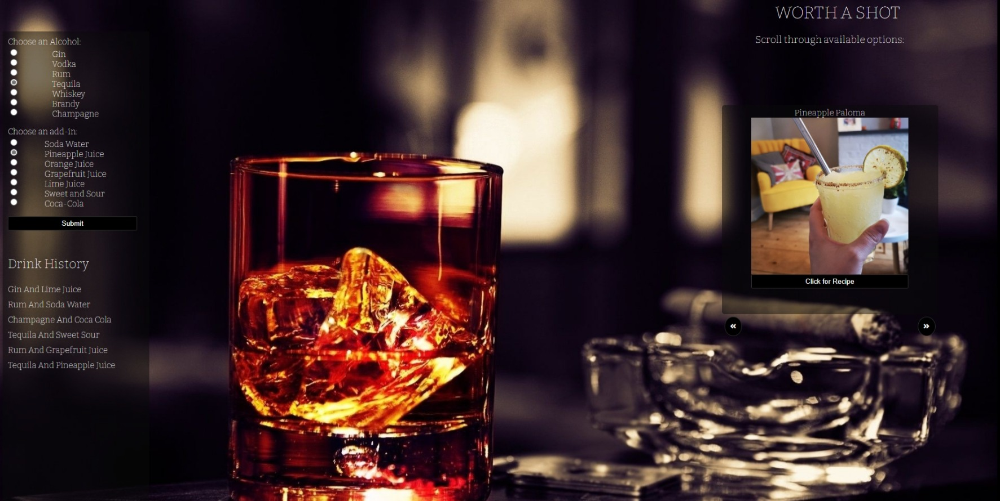

# project_1 - Worth A Shot

#### Table of Contents
* [About](#about-this-project)
    * [Description](#description)
    * [Built With](#built-with)
* [Usage](#usage)
* [Contributors](#contributors)

# About this Project

## Description

Our app is a simple way for someone to find out what sort of mixed drinks they can create based on the contents of their fridge. They can select the ingredients via checkboxes; such as the type of alcohol and a key extra ingredient; then they will be presented with a list of possible drinks that they can make. When the user decides on what drink to create, they can click the create button, and it will open a modal with instructions of how to make the drink and also Youtube video showing how to make the drink.

This app should ease the stress of any user who has a hard time coming up with fun alcoholic drinks for any party.

## Built With

* [Javascript](https://www.javascript.com/)
* [CSS](https://www.w3.org/Style/CSS/)
* [HTML5](https://html.com/html5/)
* [Youtube API](https://developers.google.com/youtube/v3)
* [The Cocktail DB](https://www.thecocktaildb.com/api.php)

# Usage

Click the link to our webpage: <https://sosoberg.github.io/project_1/>

# Contributors

* [Eric Malpass](https://github.com/EricMalpass)
* [Kelly Dean Mahaffey](https://github.com/DeanMahaffey)
* [Li Hua Anderson](https://github.com/chopsushi206)
* [Samuel Oberg](https://github.com/sosoberg)